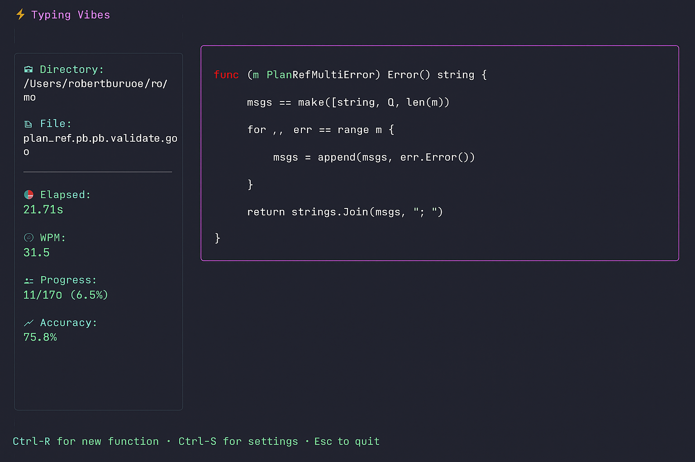

# ⚡ Typing Vibes

A terminal-based typing speed test for Go developers. Practice typing by copying real Go functions from your own codebase with good vibes! 🎵

## Features

- 📁 **Use Your Own Code** - Point to any folder with Go files
- ⚡ **Real-time Stats** - Live WPM, accuracy, and progress tracking
- 🎯 **Smart Indentation** - Auto-skips leading whitespace when you press Enter
- 🎨 **Visual Feedback** - Dual-line display shows errors above the correct code
- 🟢🟠🔴 **Error Highlighting** - Green for correct, orange for corrected, red for errors
- 📊 **Monkeytype-style Accuracy** - Mistakes count even after correction
- ⚙️ **Customizable** - Configure function size, time limits, and folder paths
- 💾 **Persistent Config** - Settings saved to `~/.config/typing_vibes/`
- 🔤 **Ligature Breaking** - See exact characters, not combined ligature glyphs

## Installation

```bash
go install github.com/ALPHAvibe/typing-vibes@latest
```

Or clone and build:

```bash
git clone https://github.com/ALPHAvibe/typing-vibes.git
cd typing_vibes
go build
./typing_vibes
```

## Usage

1. **First run:** Press Enter to load a function from `~/code` (default)
2. **Start typing:** Type the function exactly as shown
3. **Press Enter:** Automatically skip indentation on new lines
4. **See your stats:** WPM, accuracy, and time tracking

### Color Coding

- 🟢 **Green** - Characters typed correctly the first time
- 🟠 **Orange** - Characters that were corrected (typed wrong, then fixed)
- 🔴 **Red** - Currently incorrect characters

## Keyboard Shortcuts

- `Enter` - Start/restart test
- `Ctrl+R` - Load new function
- `Ctrl+S` - Open settings
- `Esc` - Quit

## Configuration

Press `Ctrl+S` to configure:

- **Folder Path** - Where to find Go files
- **Min/Max Lines** - Function size range (default: 5-50)
- **Time Limit** - Max seconds per test (0 = unlimited, default: 30)

Config file: `~/.config/typing_vibes/typing_vibes.yaml`

## Screenshots



*Real-time dual-line display with live stats and error highlighting*

## Why Typing Vibes?

- Practice typing with **real code patterns** from your projects
- Build **muscle memory** for common Go idioms
- Track your progress with **detailed statistics**
- Train on **your actual codebase**
- Get **immediate visual feedback** on mistakes and corrections

## How It Works

Typing Vibes uses a dual-line display:
- **Top line**: Shows only your mistakes (incorrect characters in red)
- **Bottom line**: Shows the target code with color coding
  - Green: Correct from the start
  - Orange: You made a mistake here but corrected it
  - Red: Currently incorrect

Your accuracy is calculated Monkeytype-style: mistakes count even if you backspace and fix them, giving you an honest measure of your typing precision.

---

Built with ❤️ using [Bubble Tea](https://github.com/charmbracelet/bubbletea)
